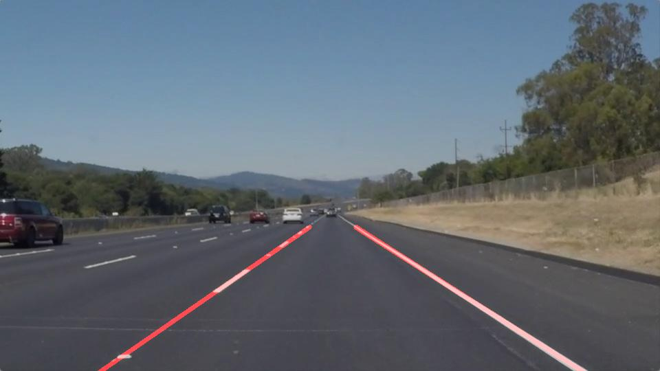

# **Finding Lane Lines on the Road** 

**Finding Lane Lines on the Road**

The goals / steps of this project are the following:
* Make a pipeline that finds lane lines on the road
* Reflect on your work in a written report

Example:

### Reflection

### 1. Describe your pipeline. As part of the description, explain how you modified the draw_lines() function.

My pipeline consisted of:
* I converted the images to grayscale
* Use Gaussian Smoothing to remove noises
* Use canny method to find edeges
* mask the edeges to focusing intersting areas
* Hough Transform to find lines

In order to draw a single line on the left and right lanes, I modified the draw_lines() function by:
* filter out lines whos slop smaller than 0.5 and bigger than -0.5
* for the lines slop >= 0.5 (left line), calcualte the average X axis for the bottom and top points for the final left line
* for the lines slop <= -0.5 (right line), calcualte the average X axis for the bottom and top points for the final right line

### 2. Identify potential shortcomings with your current pipeline

* if there are cars close to the lines, it might consider the car edges as lines and make it part the average X calcualtion. save for other objects in the interstaing area.
* doesn't work for curbey lines

### 3. Suggest possible improvements to your pipeline

* order the lines, group the lines based on slop and position. chose one as left/right lines and filter all the other lines.
* instead draw one big straight line. can link the line one by one to support curvey lines. and also need to modify the first step (group lines) to spport incrementally slop change and still consider them as in one group.